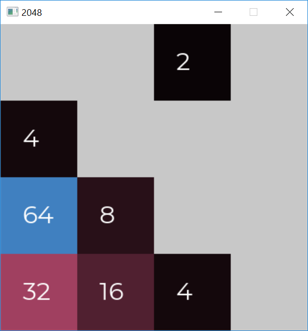

# 2048
An implementation of the game 2048 in C++ and SDL.
If you want to see it in action, Download the ```/Release``` folder with all the dll files in it and run 2048.exe


</img>
## Requirements
Requires linking SDL2 and SDL2_ttf libraries. If you want to modify this code,make sure to link those libraries to your Visual Studio solution.
## Built With
* C++
* SDL2 and SDL2_ttf libraries

## License

This project is licensed under the MIT License - see the [LICENSE.md](LICENSE.md) file for details

## Acknowledgments

* based on '2048 by Gabriele Cirulli' ,originally written in JavaScript and CSS


